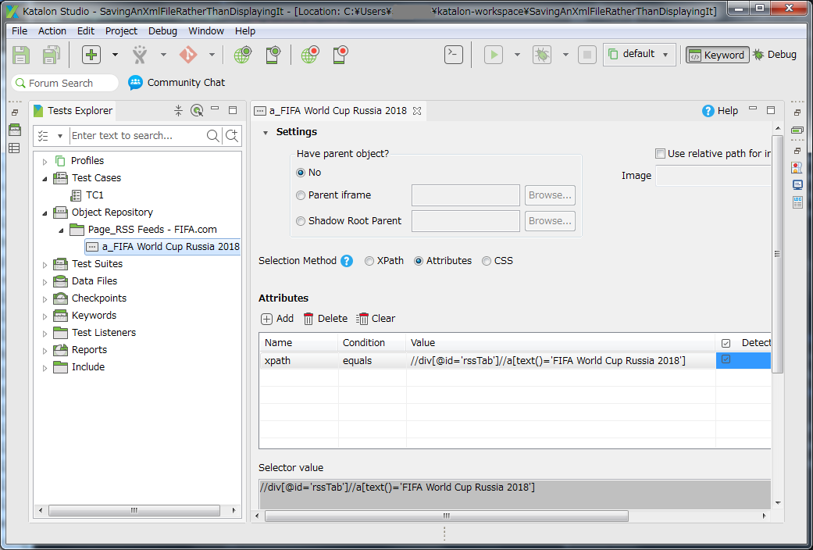
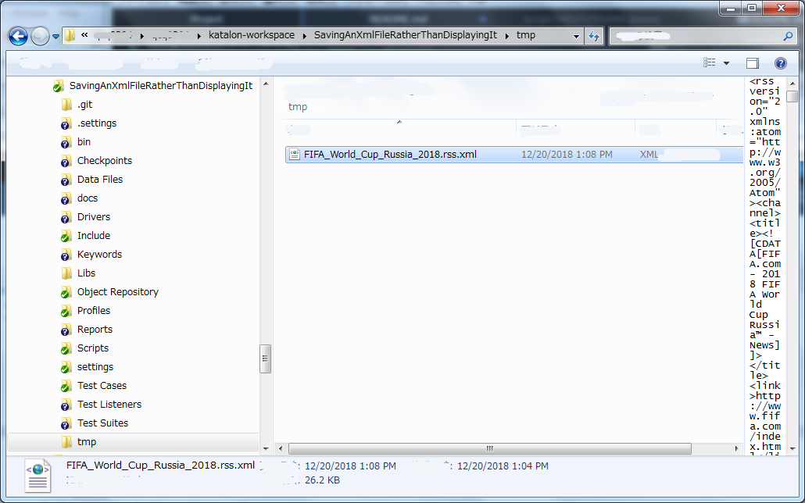

Saving an XML file rather than displaying it
====

This is a small Katalon Studio project for demonstration purpose.
You can download the zip from [Releases] page, unzip it, open the project with
your Katalon Studio.

This project was developed using Katalon Studio 5.10.0.

## Problem to solve

This project was developed to propose a solution to a question raised
in the Katalon Forum: [Saving an XML file rather than displaying it](https://forum.katalon.com/t/chrome-saving-an-xml-file-instead-of-displaying-it/15677/4), which said
>i have to automate a test case where the user goes to a website, clicks right in an xml file, and saves it in a certain folder. This cannot be done with Katalon unless there is a way to download the xml instead of displaying it. Any ideas how to do this?

## Solution

In Katalon Studio, a test case can use 2 types of built-in keywords together: WebUI keywords and WebService keywords. You will use WebUI keyword to scrape a web page to identify the URL of an XML you want. And you can download the XML document using WebService keywords. You do not necessarily use external downloading commands such as `wget` or `curl`.

## Description of the demo project

My target web site is
- http://static.fifa.com/rss-feeds/index.html

The page contains a link with label "FIFA World Cup Russia 2017". This links to a XML document
- http://static.fifa.com/worldcup/news/rss.xml

I want to download the XML and save it into a local file.


I made a TestObject named `a_FIFA World Cup Russia 2018`

This test object has a xpath
```
//div[@id='rssTab']//a[text()='FIFA World Cup Russia 2018']
```

I wrote a test case [TC1](Scripts/TC1/Script1545272253488.groovy)
```
import static com.kms.katalon.core.testobject.ObjectRepository.findTestObject

import java.nio.file.Files
import java.nio.file.Path
import java.nio.file.Paths

import com.kms.katalon.core.configuration.RunConfiguration
import com.kms.katalon.core.model.FailureHandling as FailureHandling
import com.kms.katalon.core.testobject.RestRequestObjectBuilder
import com.kms.katalon.core.webservice.keyword.WSBuiltInKeywords as WS
import com.kms.katalon.core.webui.keyword.WebUiBuiltInKeywords as WebUI

def anchorElement = findTestObject('Object Repository/Page_RSS Feeds - FIFA.com/a_FIFA World Cup Russia 2018')

// Open site
WebUI.openBrowser('')
WebUI.setViewPortSize(800, 600)
WebUI.navigateToUrl('http://static.fifa.com/rss-feeds/index.html')
WebUI.scrollToElement(anchorElement, 3, FailureHandling.STOP_ON_FAILURE)
WebUI.verifyElementPresent(anchorElement, 10, FailureHandling.STOP_ON_FAILURE)
// identify URL of the XML document
def href = WebUI.getAttribute(anchorElement, "href")
// will see href="http://static.fifa.com/worldcup/news/rss.xml"
println "href=${href}"
WebUI.closeBrowser()

// Create a new GET object using builder
def builder = new RestRequestObjectBuilder()
def requestObject = builder
	.withRestRequestMethod("GET")
	.withRestUrl(href)            // here we specify the URL found in the web site
	.build()

// Send a request'
def response = WS.sendRequest(requestObject)

// Verify if the response from the URL returns the 200 status code'
WS.verifyResponseStatusCode(response, 200)

// Get the content string
def content = response.getResponseBodyContent()

// prepare output directory
Path projectdir = Paths.get(RunConfiguration.getProjectDir())
Path outputdir = projectdir.resolve("tmp")
Files.createDirectories(outputdir)
Path file = outputdir.resolve("FIFA_World_Cup_Russia_2018.rss.xml")

// save XML into file
file.toFile().write(content)
```

I ran this test case and got a XML file saved in `<projectdir>/tmp/FIFA_World_Cup_Russia_2018.rss.xml`


This worked for me.
